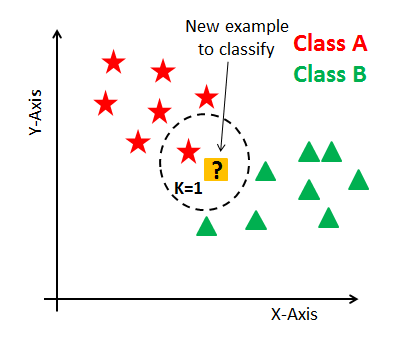
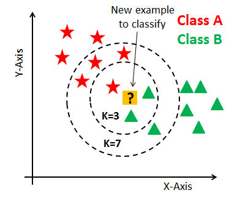

title: "Hello"
password: KNN

# Algorithme des $k$ plus proches voisins

## Présentation
<!--
<table>   <tr>
    <td>Numérique et Sciences Informatiques - Niveau Première mais vu en Terminale                                                          </td>
    <td></td>
    </tr>   
</table>
    
<b>Algorithmique</b>  

# 
 <b>Algorithmique des k plus proches voisins</b>   
 
-->

 ou  k-NN ou KNN, de l'anglais k-nearest neighbors. 

L'`apprentissage automatique`, également appelé apprentissage machine ou apprentissage artificiel et en anglais `machine learning`, est une forme d'intelligence artificielle (IA) qui permet à un système d'<b>apprendre à partir des données</b> et non à l'aide d'une programmation explicite. Cependant, l'apprentissage automatique n'est pas un processus simple. Au fur et à mesure que les algorithmes ingèrent les données de formation, il devient possible de créer des modèles plus précis basés sur ces données. 

L’idée d’apprentissage automatique ne date pas d’hier, puisque le terme de machine learning a été utilisé pour la première fois par l’informaticien américain Arthur Samuel en 1959. Les algorithmes d’apprentissage automatique ont connu un fort regain d’intérêt
au début des années 2000 notamment grâce à la quantité de données disponibles sur internet.
    
 L'`algorithme des plus k proches voisins` appartient à la famille des <b>algorithmes d’apprentissage automatique (machine learning).</b>

L’algorithme des k plus proches voisins est un algorithme d’apprentissage supervisé, il est nécessaire d’avoir des données labellisées. À partir d’un ensemble E de données labellisées, il sera possible de classer (déterminer le label) d’une nouvelle donnée (donnée
n’appartenant pas à E).

On peut préciser que de nombreuses sociétés (exemple les GAFAM) utilisent les données
concernant leurs utilisateurs afin de ”nourrir” des algorithmes de machine learning qui permettront à ces sociétés d’en savoir toujours plus sur nous et ainsi de mieux cerné nos ”besoins” en termes de consommation 

# Activité découverte d'apprentissage automatique : 

*Vous avez décidé d’installer un serveur dans votre entreprise pour pouvoir gérer au mieux vos outils numériques, et donc notamment vos emails. Comme pour toute boîte d’emails, il est possible d’en recevoir certains qui s’avèrent être frauduleux, que l’on appelle des spams; votre serveur étant privé, vous ne disposez pas encore d’outil permettant de les détecter et vous souhaitez ainsi en construire un.*

##  0. Explications : l'algorithme des k plus proches voisins. 

L’objectif de ce TP est de créer un outil basique de classification (catégories spam / non spam)  faisant intervenir seulement vos compétences algorithmiques, et de vous montrer un premier mécanisme simple d’apprentissage automatique (dit de “machine learning”).

Problématique : comment faire pour classer un email ? 

### a) Comment peut-on classer un objet suivant ses caractéristiques ? En le comparant aux autres ! 

Prenons l'exemple d'une situation où vous avez un sac rempli de fruits avec deux possibilités (Abricot ou Banane) et que pour chacune des possibilités, vous connaissez deux caractéristiques (X : Poids et Y : Taille). Vous êtes alors en mesure de placer les différents éléments dans un repère (orthonormé) avec les axes représentant la taille et le poids de l'élément, et d'avoir alors un aperçu des caractéristiques de votre sac. 

Maintenant, imaginons que vous plongez la main dans le sac et découvrez un fruit oublié, non classé et que pour une certaine raison, vous n'êtes pas capable de le sortir mais pouvez déterminer son poids et sa taille avec votre main. A quelle catégorie est-ce que ce fruit appartient ? 

Comme vous le voyez sur l'image, Abricots et Bananes forment des zones/clusters dans votre repère. Vous pourriez alors deviner, suivant où se situe votre fruit inconnu dans ce repère, à quel type de fruit il appartient : s'il est au milieu des étoiles, alors c'est plus probablement un abricot, et s'il est au milieu des triangles, ça risque d'être une banane. 

Mais ici, entre les deux, ce n'est pas évident. Ce que l'on va faire c'est calculer la distance (attention, il existe différentes définitions de distance, adaptées plus ou moins suivant ce que l'on regarde, mais ce sera vu plus tard) dans ce repère entre le fruit inconnu et ses voisins, et voir de <b>quel groupe il est le plus proche en regardant qui sont ses plus proches voisins. </b> 

Si, comme l'image précédente, on considère son voisin le plus proche (k=1) alors c'est plutôt un abricot. Si on considère que statistiquement, un seul avis n'est pas suffisant pour se faire une idée, on peut prendre un groupe plus étendu :  

-   k = 1 : le fruit est probablement un Abricot car on ne considère qu'une étoile.
-   k = 3 : il y a 2 triangles contre 1 étoile, le fruit serait en fait plus proche des Bananes.
-   k = 7, 3 triangles contre 4 étoiles, notre a priori est plutôt de dire que c'est un Abricot. 
-   k= ...   **(doit toujours être inférieur ou égal au nombre total de voisins)**

On voit ainsi que le choix <b>k</b> du nombre de plus proches voisins (mais aussi du choix de la définition de la distance) est un paramètre important à prendre en compte car <b>il détermine notre décision</b>. Mais ce n'est pour l'instant pas ce qui nous préoccupe, établissons déjà un algorithme pour un k donné. 

Pour déterminer la valeur optimale des paramètres comme k, on scinde généralement les données en deux : une partie qui servira à "entraîner" un modèle (ce n'est pas exactement le cas ici) suivant les valeurs de paramètres et l'autre à le tester, et on sélectionnera le modèle et donc les paramètres qui aura eu le plus de succès dans la phase de test. 

### b) Avec ses plus proches voisins, donc les plus près ... mais suivant quelle distance ? 

Concernant les distances, laquelle choisir ?
* si les caractéristiques sont des ... mots ou couleur ? 

* si les caractéristiques sont des nombres, il en existe plusieurs (voir une liste https://arxiv.org/pdf/1708.04321.pdf) : 

   * sur une ligne, la distance entre deux points est donnée par la valeur absolue de la différence des abscisses des deux points : 
   $d = |x_A - x_B|$  mais on peut généraliser cela sur un plan : connaissant les coordonnées de deux points $A(x_{A};y_{A})$ et $B(x_B;y_B)$, alors une distance possible est $d=|x_A-x_B| + |y_A - y_B|$ que l'on appelle distance de Manhattan (on ajoute l'écart horizontal à l'écart vertical).
   
   * ou bien utiliser la distance euclidienne que vous avez vu en seconde : 
   $d=\sqrt{(x_A-x_B)^2+(y_A-y_B)^2}$ 
   (à 1 dimension, sur une ligne, on a $d=\sqrt{(x_A-x_B)^2}=|x_A-x_B|$ les deux définitions donnent la même distance)

que l'on peut généraliser si on considère plus de deux caractéristiques : si on considère 3 paramètres, alors on doit rajouter une dimension à notre plan (on parle alors de 3D), on est donc dans l'espace, et notre repère orthonormé devient un ... cube.

!!! warning 

    Connaissant les coordonnées de deux points $A(x_{A};y_{A};z_{A})$ et $B(x_B;y_B;z_B)$, la distance 

    - de Manhattan devient $$ d=|x_A-x_B|+|y_A-y_B|+|z_A-z_B| $$
    - euclidienne devient  $$ d=\sqrt{ (x_A-x_B)^2 + (y_A-y_B)^2 + (z_A-z_B)^2} $$ 

et on peut alors en suivant cette démarche, généraliser les distances à n'importe quelle dimension (utile si par exemple, on considère dans notre problème les caractéristiques : poids, taille, couleur, intelligence, dureté, ce qui nous oblige à calculer des distances dans des espaces à 5 dimensions)

<b>Il existe un nombre conséquent de définitions possibles de distances, et on choisit généralement celle qui donne les meilleurs résultats dans la phase de test (une fois les données découpées).</b>

### c) Quelles sont les étapes de l'activité que vous devez réaliser et savoir faire ? 

Tout au long de cette ativité, vous allez pouvoir ré-exploiter des compétences vues auparavant (utilisation de listes, d'algorithmes de tri sur ces listes, ....), mais aussi réfléchir à comment traiter certains passages.
s

Quelque soit le jeu de données, vous devrez : 

1. Lire un fichier de csv de données, encodé en utf8, et en ressortir une liste de listes (déjà vu mais le type de données à obtenir est différent)
2. Mise en forme des données : utilisation d'un masque (à faire)
3. Trouver la distance entre deux des objets (à faire)
4. Faire un algorithme qui sort les k plus proches voisins d'un objet mystère dans une liste (à faire)
5. Faire un algorithme qui donne le type dominant parmi ces plus proches voisins et en conclut le type probable de l'objet mystère (à faire)

On pourra voir la vidéo https://www.youtube.com/watch?v=t9LHdng2Kzk pour obtenir un aperçu global de ce qui est demandé.

{{IDE('py_files/knn_eleves_1')}}

